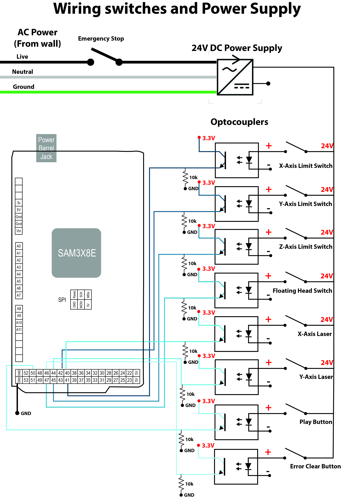

# <i class="fad fa-outlet"></i> Electrical Setup
---
### <i class="fas fa-play-circle"></i> Getting Started 
If you have little experience with wiring with electronics, then it is strongly recommended to read up on the proper precautions that need to be taken [here](https://electrical-engineering-portal.com/21-safety-rules-for-working-with-electrical-equipment). Along a similar vein, if you have never soldered, then a breadboard can be used to wire the whole project. Breadboard connections are less durable than a solder joint, but jumper cables allow you to avoid soldering.

Building an automatic liquid handler follows many of the principles used by DIYers to build 3D printers and CNC routers, which are found in many households. It is recommended to watch videos such as this [one](https://youtu.be/qub5chyIQ0s) to learn the operating principles behind stepper motors, stepper drivers, limit switches, etc. 

### <i class="fas fa-plug"></i> Electrical System Components
Roughly there are three main parts of OTTO's electrical system:
- The microcontroller
- The stepper drivers and motors
- Sensors and buttons

Check out the bill of materials for part numbers, quantities, and retailers <i class="fas fa-list-ol"></i> Bill of materials for the electrical components. 

### <i class="fas fa-microchip"></i> Microcontroller

It’s the microcontroller’s job to translate positional coordinates sent over as G-code from a computer into stepper motor movements. This job includes not only barking orders, like telling the stepper drivers when and in what direction to move the motors, but also requires the microcontroller to listen and respond to various inputs like the extruder temperature or the state of the limit switches.

A microcontroller is housed on a motherboard, which provides the components that the microcontroller requires to operated (i.e., 3.3V) and the terminals for users to connect various electrical devices to. The most popular microcontroller/motherboard combo is either the ATmega328P/Arduino Uno or the ATmega2560/Arduino Mega. Neither of these boards were used for OTTO because these 8-bit processors were unable to produce enough step pulses when running the AccelStepper library (see [software section](https://openliquidhandler.com/software) for more information). We instead used the Arduino Due which is powered by the snappy 32-bit ARM core microcontroller. 

If you are familiar with CNC controller boards, then perhaps you are wondering why we did not use an all-in-one motherboard that includes not only the microcontroller but also the stepper drivers. First off, it is possible to run OTTO with one of these boards and they definitely cut down on a lot of wiring, but these boards typically do not have stepper drivers capable of driving the power hungry Nema23 motors that are used to move the gantry.

### <i class="fad fa-cog"></i> Stepper Motors and Drivers
The first step is to wire all stepper motors to the stepper drivers. It is recommended to watch this [video](https://www.youtube.com/watch?v=IEmGOuMFPKQ) if you require more information than the schematic below.

Next, the stepper drivers need to be wired to Arduino Due and power supply. For this project, TMC2660 drivers were used. These drivers are more complicated than the run-of-the-mill stepper drivers because they communicate with the Due through a Serial Peripheral Interface (SPI) connection, which allows the motor current and microstepping to be set digitally. This is very helpful when calibrating the system. The TMC2660 also have a lot of other features, such as near silent operation. You can find their datasheet [here](https://www.trinamic.com/products/integrated-circuits/details/tmc2660-pa/) to learn more about them. With these added features comes more wiring. The SDO, SDI, SCK, CSN pins on the driver needs to be connected to their respective pins on the Due outlined below. An in depth guide on SPI is available on the [Arduino website](https://www.arduino.cc/en/reference/SPI"). If you are overwhelmed by all the wiring you can use a more basic stepper driver like the [TB6600](https://www.amazon.com/dp/B07B9ZQF5D/ref=cm_sw_em_r_mt_dp_U_AF.KEb8BAKC99) that doesn’t use SPI. The only requirements for the stepper drivers are that they support Bipolar hybrid stepper motors and can supply at least 2A of current.

Each TMC2660 stepper driver requires 18 electrical connections to be operational. Four of these connections are for the SPI communication (SDO, SDI, SCK, CSN), four provide power to the stepper motor’s leads (A1, A2, B1, B2), three instruct the driver on how to move the stepper motor (step, direction, enable), five of these connections need to made to ground, and finally, two connections to power (VCC to 3.3V and VS to 24V). For ease of wiring, a breadboard is strongly recommended because the drivers can be placed on the breadboard and those 5 ground connections can be connected together quickly with jumper cables. Further, the SDI, SCK, CSN from each stepper driver board need to be connected in parallel to their respective pins on the Arduino. 

Below are tables describing the required connection to the Due board and power supply. If you connect your pins precisely as below then you will not have to make any changes to the firmware. However, it is not a big deal if you swap some of the digital pins. For example, if you wire the X-axis stepper driver’s enable pin to digital pin 40 instead of 22. This can be easily changed in the firmware, but you should note this difference. 

#### Common Pins

<table class="table">
  <thead>
    <tr>
      <th scope="col">Stepper Driver Pin</th>
      <th scope="col"> Connection </th>
    </tr>
  </thead>
  <tbody>
    <tr>
      <th scope="row">VS</th>
      <td>24V Power Supply</td>
    </tr>
    <tr>
      <th scope="row">GND</th>
      <td>Ground</td>
    </tr>
    <tr>
      <th scope="row">VCC</th>
      <td>Arduino 3.3V Pin</td>
    </tr>
    <tr>
      <th scope="row">SDO</th>
      <td>Arduino MISO Pin</td>
    </tr>
    <tr>
      <th scope="row">SDI</th>
      <td>Arduino MOSI Pin</td>
    </tr>
    <tr>
      <th scope="row">SCK</th>
      <td>Arduino SCK Pin</td>
    </tr>
  </tbody>
</table>

#### X-axis
<table class="table">
  <thead>
    <tr>
      <th scope="col">Stepper Driver Pin</th>
      <th scope="col">Arduino Pin</th>
    </tr>
  </thead>
  <tbody>
    <tr>
      <th scope="row">Enable</th>
      <td>22</td>
    </tr>
    <tr>
      <th scope="row">Step Pulse</th>
      <td>23</td>
    </tr>
    <tr>
      <th scope="row">Direction Pulse</th>
      <td>24</td>
    </tr>
    <tr>
      <th scope="row">Chip Select</th>
      <td>25</td>
    </tr>
  </tbody>
</table>

#### Y-axis

OTTO’s mechanical design calls for two linear actuators to move the gantry in the Y direction. It is very important that these Y-axis stepper motors are perfectly synchronized in their movements. There are two ways to do this: 1) buy a stepper driver that can supply enough current for two stepper motors (in our case >4A) and wire the two stepper motors to the same drive or 2) wire the stepper motors to separate drivers but have the drivers share a Step, Direction, and Enable pin. When designing OTTO we followed the second route because the TMC2660 stepper drivers can supply at most 2A. This is why there is only one Arduino pin listed in the table below even though there are two stepper drivers pictured in the below schematic. 

<table class="table">
  <thead>
    <tr>
      <th scope="col">Stepper Driver Pin</th>
      <th scope="col">Arduino Pin</th>
    </tr>
  </thead>
  <tbody>
    <tr>
      <th scope="row">Enable</th>
      <td>26</td>
    </tr>
    <tr>
      <th scope="row">Step Pulse</th>
      <td>27</td>
    </tr>
    <tr>
      <th scope="row">Direction Pulse</th>
      <td>29</td>
    </tr>
    <tr>
      <th scope="row">Chip Select</th>
      <td>28</td>
    </tr>
  </tbody>
</table>

#### Z-axis
<table class="table">
  <thead>
    <tr>
      <th scope="col">Stepper Driver Pin</th>
      <th scope="col">Arduino Pin</th>
    </tr>
  </thead>
  <tbody>
    <tr>
      <th scope="row">Enable</th>
      <td>31</td>
    </tr>
    <tr>
      <th scope="row">Step Pulse</th>
      <td>32</td>
    </tr>
    <tr>
      <th scope="row">Direction Pulse</th>
      <td>33</td>
    </tr>
    <tr>
      <th scope="row">Chip Select</th>
      <td>34</td>
    </tr>
  </tbody>
</table>

#### Pipette
<table class="table">
  <thead>
    <tr>
      <th scope="col">Stepper Driver Pin</th>
      <th scope="col">Arduino Pin</th>
    </tr>
  </thead>
  <tbody>
    <tr>
      <th scope="row">Enable</th>
      <td>35</td>
    </tr>
    <tr>
      <th scope="row">Step Pulse</th>
      <td>36</td>
    </tr>
    <tr>
      <th scope="row">Direction Pulse</th>
      <td>37</td>
    </tr>
    <tr>
      <th scope="row">Chip Select</th>
      <td>38</td>
    </tr>
  </tbody>
</table>

The below schematic is a picture version of what is described in the tables above. This is a high-resolution image, and you may have to zoom in <i class="fas fa-search-plus"></i> to see the labels. You can also right click and save the image to your desktop.

### <i class="fas fa-light-switch-off"></i> Buttons and Sensors

Understanding how to wire buttons, switches, and sensors to an Arduino is critical for having an operational liquid handler. Limit switches allows the microcontroller to establish a repeatable coordinate system. With properly wired limit switches, OTTO will be able to find pipette tips or the wells of a plate after a power cycle by performing a homing routine. It is recommended to read this [Arduino article](https://www.arduino.cc/en/Tutorial/DigitalPins) about digital pins. These pins can read the input from a switch. If this concept is new to you, then performing the button wiring tutorial found [here](https://www.arduino.cc/en/tutorial/button) is time well spent. 

#### Switches and Optocouplers

A switch has two states:
1. High
2. Low

When a switch is pressed, it’s important that it switches states. This is especially true for a limit switch where a failure to switch states usually results in the machine crashing. A limit switch typically fails to switch states when there is an open circuit (i.e. improper wiring). For this reason, most limit switches are wired in a normally closed (NC) configuration. With NC wiring, the circuit is usually complete (i.e., closed) when the limit switch is untouched, but becomes open when the limit switch is bumped. Basically, with the NC switch is wired wrong and the result is an open circuit then OTTO will know not to move because it thinks it as its limit. You can learn more about the different ways to wire limit switches [here](https://github.com/gnea/grbl/wiki/Wiring-Limit-Switches).

Even a NC limit switch can have erroneous states when in the presence of enough electrical noise caused by electromagnetic interface. The wires that go to the limit switch run right next the wires that power the stepper motors, and any conductor with current flowing through it has an associated magnetic field. You can learn more about electrical noise [here](https://www.fluke.com/en-us/learn/blog/power-quality/electrical-noise-and-transients). The important take away is that the lower the signal voltage the less noise can be tolerated by a circuit. The Arduino Due operates at 3.3 V. This low voltage signal is easily corrupted by noise over long wires, such as those that connect to the limit switch. For this reason, OTTO uses 24V as the signal to the limit switch, and then an optocoupler “steps” this voltage down to 3.3V. It’s very important to note that supplying anything more than 3.3V to a digital pin will fry the Arduino Due. This is why an optocoupler is must and is used for all the buttons and switches. Learn more about this technology  [here](https://www.electronics-tutorials.ws/blog/optocoupler.html). 

